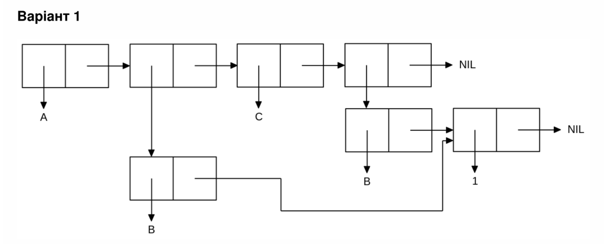

<p align="center"><b>МОНУ НТУУ КПІ ім. Ігоря Сікорського ФПСПМ СПіСКС</b></p>
<p align="center">
<b>Звіт з лабораторної роботи 1</b><br/>
"Обробка списків з використанням базових функцій"<br/>
дисципліни "Вступ до функціонального програмування"
</p>
<p align="right"><b>Студентка</b>: Швидько Крістіна Романівна КВ-31</p>
<p align="right"><b>Рік</b>: 2026</p>
## Загальне завдання

```lisp
;; Step 1. Створіть список з п'яти елементів, використовуючи функції LIST і
;; CONS . Форма створення списку має бути одна — використання SET чи SETQ
;; (або інших допоміжних форм) для збереження проміжних значень не
;; допускається. Загальна кількість елементів (включно з підсписками та їх
;; елементами) не має перевищувати 10-12 шт. (дуже великий список робити не
;; потрібно). Збережіть
;; створений список у якусь змінну з SET або SETQ . Список має містити
;; (напряму або у підсписках):
;; хоча б один символ
;; хоча б одне число
;; хоча б один не пустий підсписок
;; хоча б один пустий підсписок
* (setq my-list
        (list 'hi 36 (cons 'sec (list 7)) nil (cons 'thir nil)))
(HI 36 (SEC 7) NIL (THIR))

;; Step 2 Отримайте голову списку.

* (car my-list)
HI

;; Step 3 Отримайте хвіст списку.

* (cdr my-list)
(36 (SEC 7) NIL (THIR))

;; Пункт 4 Отримайте третій елемент списку.

* (third my-list)
(SEC 7)

;; Пункт 5

* (car (last my-list))
(THIR)

;; Пункт 6

* (atom (first my-list))
T
* (atom (second my-list))
T
* (atom (third my-list))
NIL
* (listp (first my-list))
NIL
* (listp (third my-list))
T
* (listp (fourth my-list))
T

;; Пункт 7

* (eql (second my-list) 36)
T
* (equal (third my-list) '(sec 7))
T
* (equalp (second my-list) 36.0)
T

;; Пункт 8

* (append my-list (third my-list))
(HI 36 (SEC 7) NIL (THIR) SEC 7)

```

## Варіант 1

<p align="center">

</p>

```lisp
(let ((tail (list 1)))
    (list 'a
          (cons 'b tail)
          'c
          (cons 'b tail)))
(A (B 1) C (B 1))
```
